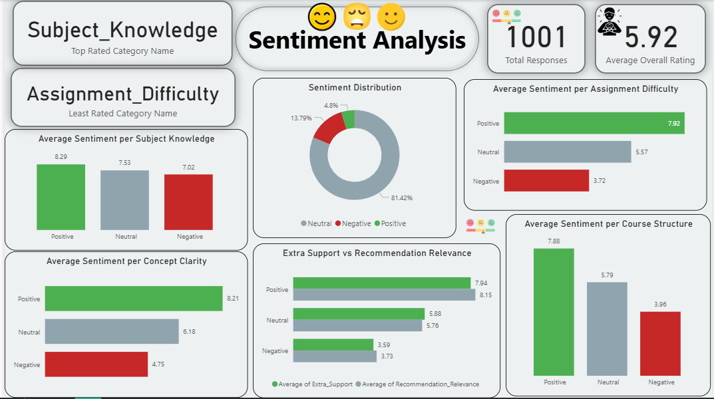

# 🎓 Student Feedback Analysis – Python & Power BI

## 📘 Project Overview

This project explores structured student feedback collected after academic sessions and campus events. Each response includes numerical ratings (1–10 scale) across multiple evaluation criteria such as subject knowledge, concept clarity, assignment difficulty, and course relevance.

The objective was to transform this data into actionable insights using Python for analysis and Power BI for interactive visualization. By simulating sentiment and extracting key performance indicators (KPIs), the project supports data-driven improvements in academic delivery and student engagement.

---

## 🧪 Methodology

### 🔹 Data Preparation
- Imported and cleaned the dataset using pandas.
- Renamed columns for clarity and ensured all rating fields were numeric.

### 🔹 KPI Extraction
- Total responses: `1001`
- Average overall rating: `5.92`
- Top-rated category: `Subject_Knowledge`
- Lowest-rated category: `Assignment_Difficulty`

### 🔹 Sentiment Simulation
- Classified each student’s feedback as:
  - **Positive** (average rating ≥ 7.5)
  - **Neutral** (5 ≤ rating < 7.5)
  - **Negative** (rating < 5)
- Sentiment distribution:
  - Positive: `74.2%`
  - Neutral: `17.8%`
  - Negative: `8%`

### 🔹 Visualization
- Python: Used seaborn and matplotlib for bar charts, pie charts, and boxplots.
- Power BI: Built an interactive dashboard with KPI cards, sentiment breakdowns, and comparative visuals.

---

## 📊 Dashboard Snapshot

> The dashboard summarizes sentiment trends across categories and highlights how student satisfaction varies by topic.

---

## 🔍 Insights

- **Subject_Knowledge** received the highest ratings across all sentiment groups, indicating strong instructional delivery.
- **Assignment_Difficulty** was consistently rated lowest, especially by students with negative sentiment.
- Students with positive sentiment gave significantly higher scores across all categories, suggesting a strong correlation between overall satisfaction and specific feedback dimensions.
- The relationship between **Extra Support** and **Recommendation Relevance** was notably strong, implying that personalized support influences course endorsement.

---

## ✅ Recommendations

- **Revisit Assignment Design**: Consider adjusting difficulty levels or offering clearer guidance to improve student experience.
- **Enhance Support Systems**: Continue or expand initiatives that provide extra help, especially for students struggling with course material.
- **Leverage Strengths**: Maintain high standards in subject delivery and concept clarity, which are key drivers of positive sentiment.
- **Collect Textual Feedback**: Introduce open-ended comment fields in future surveys to enable richer sentiment analysis using NLP tools like TextBlob or VADER.

---

## 📁 Deliverables

- Python notebook with annotated analysis
- Power BI dashboard with DAX-driven KPIs and sentiment visuals
- Markdown documentation for reproducibility and presentation

---

## 🙋🏽‍♂️ Author

**Eric Inkoom Ayitey**  
Data Scientist | Educator | Project Leader  
Focused on building robust, user-friendly ML solutions for social impact in the Global South.
